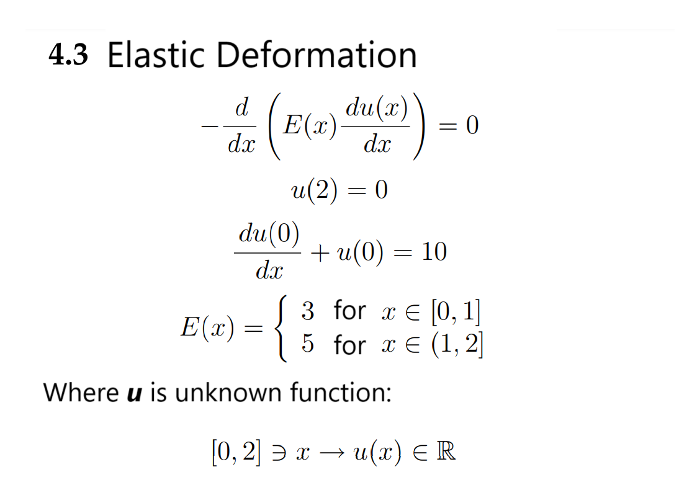
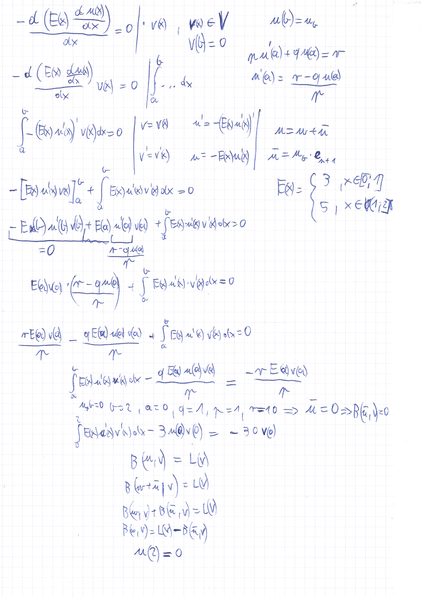
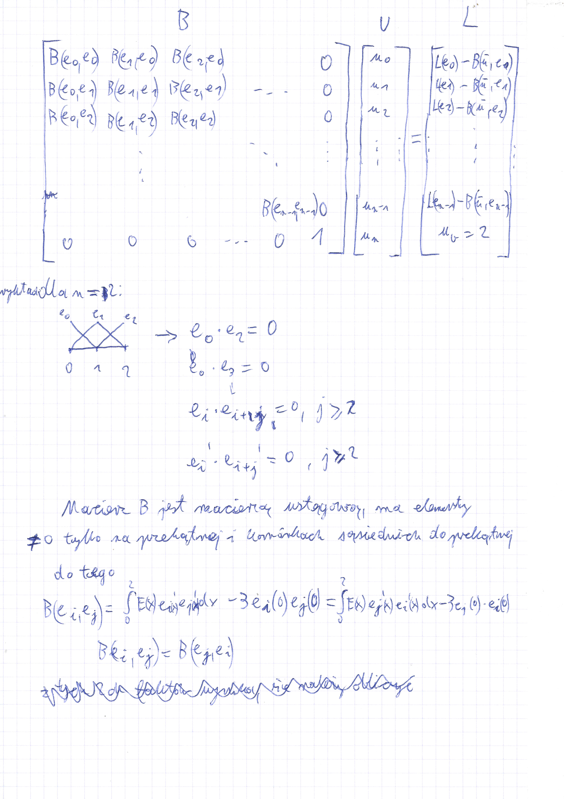
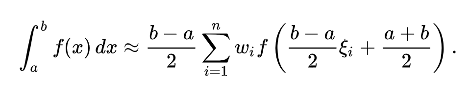
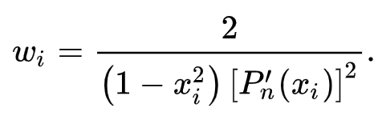
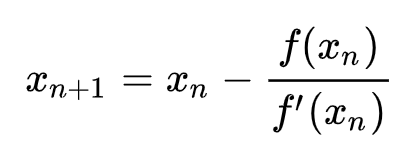
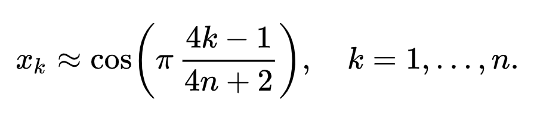
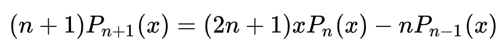
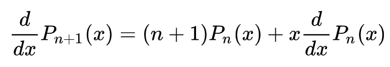
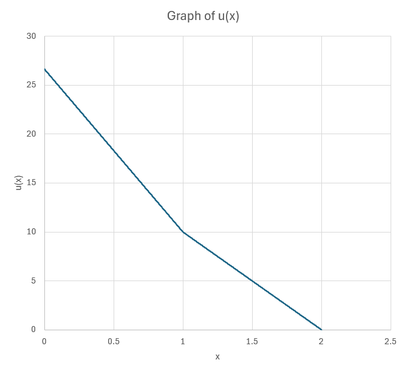

# Elastic Deformation FEM project

Computes Elastic Deformation function using **[Finite Element Method](https://en.wikipedia.org/wiki/Finite_element_method)**.

Written in `C++20` as final project for Differential and Difference Equations course.

Graded 50/50 pts

## Problem
Find u(x) satisfying:



For 50 pts, it was required for all calculations (beside formula derivation) to be computed numerically.

Integrals had to be computed using **[Gauss-Legendre quadrature](https://en.wikipedia.org/wiki/Gauss-Legendre_quadrature)** using a minimum of 2 points.

## Solution

### Derivation of equation and matrix



### Computations

**Gauss-Legendre quadrature** is computed using formula:



where:

 - i-th root of n-th Legendre polynomial

 - i-th weight, computed with formula:



My solution computes its own roots of **[Legendre Polynomials](https://en.wikipedia.org/wiki/Legendre_polynomials)** using **[Newton's method](https://en.wikipedia.org/wiki/Newton%27s_method)**



where initial approximation formula is:

(found on German Wikipedia of **[Legendre Polynomials](https://de.wikipedia.org/wiki/Legendre-Polynom#Nullstellen)**)



*f*(x) and *f*'(x) were computed using recursive formulas:





Once computed, n-th Legendre polynomial is saved to file `./cached_legendre_polynomials/<n>`, to preserve time

(~16 minutes to compute roots of 200000th polynomial)

Systems of equations shown in second picture are then solved using **[Gaussian elimination](https://en.wikipedia.org/wiki/Gaussian_elimination)** and are saved to file `result.csv`

## Building
### Clone repo
```bash
git clone https://github.com/Chris-plusplus/differential_equations_project.git
```
### Build using CMake
```bash
cd differential_equations_project
mkdir build
cd build
cmake ..
cmake --build .
```

## Usage

Solution might be executed with following command:
```bash
./differential_equations_project <finite_element_count> <integral_points>
```
or (requires input of `finite_element_count` `integral_points`)
```bash
./differential_equations_project
```

where `intergral_points` is equal to index of Legendre polynomial used.

### Final solution

